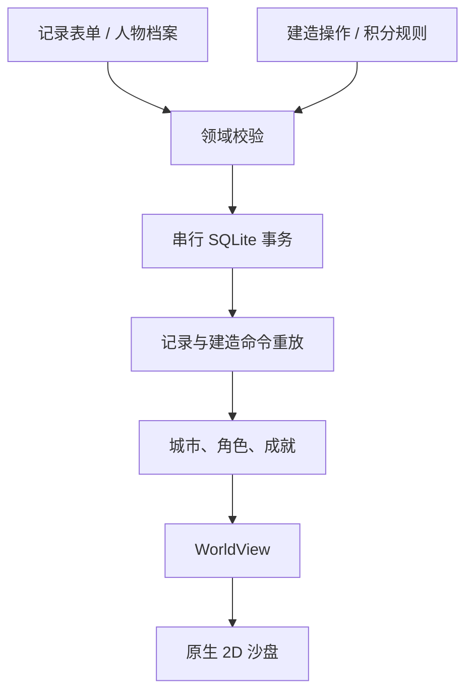

# Astra 3 · 山河：私人记录与城市沙盘

## 产品定位与入口

这是面向个人使用的 iOS 记录应用，嵌入离线 2D 城市策略沙盘。记录是事实来源，游戏是记录的可重算投影。开发入口为 `mobile/`；不迁移 SwiftUI 旧版或 React Native 2.0 数据，也不继续双线开发。旧源代码仅留在仓库供查阅。

导航改为 **山河 / 人物 / 战绩 / 成就**，新增记录常驻底栏。山河页以深绿、旧金、等距矢量建筑和省域图层呈现；档案与表单保留明亮背景和原生输入体验。

完整循环：选择城市 → 记录人物、地点与私人细节 → 预览星尘 → 保存 → 攻占城市 → 升级专属建筑 → 解锁地区成就与角色阶段。没有账号、公开排行榜、自动定位或在线对战。

## 架构选择

| 层 | 实现 | 选择理由 |
| --- | --- | --- |
| 页面与原生能力 | React Native 0.83 / React 19.2 / Expo 55 | 现有 `mobile/` 已有可用的档案、相册、认证、表单和 SQLite；重写产品主循环而不重新发明原生能力 |
| 游戏领域 | TypeScript 纯函数 | 计分、成就、城市关系、建造重放可脱离渲染器测试 |
| 2D 渲染 | React Native Skia 2.4.18 | 原生矢量 Canvas；Web 延迟加载匹配版本的本地 CanvasKit |
| 地图与手势 | 离线 GeoJSON / Gesture Handler / Reanimated 4 | 共用 WGS-84 投影、相机反算与点选，手势更新在 UI 线程 |
| 持久化 | Expo SQLite + 串行提交队列 | 人物、记录、积分规则和建造命令在同一事务中提交，落盘成功后才更新界面 |
| 渲染边界 | `WorldView` | 仅城市、等级、次数、汇总积分，不传人物、照片、身体评分、姿势或玩法标签 |

此规模不需要 Unity runtime、在线服务或通用 ECS。主要对象是静态地形、几十座当前可见建筑和玩家棋子，不包含实时部队战斗、寻路动画或多人联网。若未来加入这些能力，再评估专用引擎。

版本依据 Expo 55 的 `bundledNativeModules.json` 固定。按 [Skia Web 官方说明](https://shopify.github.io/react-native-skia/docs/getting-started/web/)延迟导入渲染组件；`postinstall` 将匹配版本的 CanvasKit WASM 复制到 `public/`，无需 CDN。原生编译由 GitHub Actions 的 macOS runner 执行。本地 Linux 验证跳过了无法下载的原生预编译库，仅验证 JS、类型和 CanvasKit；仓库 CI 保留完整 `npm ci` 安装步骤。

## 数据与积分

`Entry.details` 保存地点代号、姿势标签、玩法标签、身体特征标签、0–10 主观身体评分。`Entry.protection` 保存有套、无套或未记录。身体评分是本次记录的快照，修改人物六维评分不会悄悄改写历史记录。所有内容为非图像化私人记录，不从照片识别身体特征。

| 规则 | 默认星尘 | 频率 |
| --- | ---: | --- |
| 亲密记录 | 20 | 每条 |
| 首次人物 | 30 | 每个人首次亲密记录 |
| 首次大陆城市 | 40 | 规范化城市 ID 首次 |
| 首次地点代号 | 10 | 同一城市与地点代号组合首次 |
| 无套 | 10 | 明确选择无套的亲密记录 |
| 姿势、玩法、身体特征 | 每种 5 | 同条记录每组标签去重；跨记录可重复 |
| 主观身体评分 | 分数 × 2 | 每条记录 |

规则页面可将各项设置为 0–1000 整数，0 表示关闭。没有身体特征或玩法的内置分级表：用户自行填写标签，当前按所属维度的统一单价计分。标签最多每组 12 个，每个 24 字。无套积分只是私人游戏规则，不是健康安全评价。

引擎按 `date + id` 稳定排序，先去重记录 ID，再计算首次奖励。约会、未发生和孤立人物记录不参与计分。城市只使用记录本身的城市；人物搬家不会改变过去的足迹。未知或境外城市可保存并获得记录分，但不产生大陆城市首访奖励和领地。

## 策略与撤回语义

- 城市有过亲密记录后获得攻占资格；占领后可向相邻城市扩张。邻接图来自每城最近的四座城市，双向连接，以游戏关系而非行政接壤为准。
- 四级建造依次花费 **80 / 140 / 240 / 400** 星尘：前哨、聚落、城池、奇观。
- 星尘用于消费；总经验保留。角色等级为 `floor(sqrt(XP / 100)) + 1`。
- 等级 1 / 4 / 7 / 10 对应旅人、筑城者、领主、君主，改变玩家棋子和领地区域色彩。
- 建造命令保存目标城市、目标等级及唯一操作 ID；必须连续升级，不能越级或重复操作。
- 编辑、删除记录或修改规则后，按命令顺序重新计算。资金或路径不足的命令暂缓，不产生负余额；条件恢复后可自动恢复。界面明确提示暂缓数量。
- 记录中的同意与边界信息不能替代现实中的沟通；积分也不作医疗判断。

## 城市专属建筑

所有内置大陆城市均有独立名称、城市种子和解锁状态，7 个建筑家族。18 座城市有专门命名与家族配置，其他城市采用地区家族与城市参数生成。它们是原创游戏建筑，不是现实建筑测绘模型，也未声称逐城手工建模。

| 城市 | 建筑 | 2D 家族 |
| --- | --- | --- |
| 上海 | 浦江灯塔 | 海港灯塔 |
| 青岛 | 黄海帆塔 | 帆塔 |
| 成都 | 锦城竹庭 | 园庭 |
| 拉萨 | 雪域石堡 | 高原石堡 |
| 北京 | 燕京城门 | 城门 |
| 西安 | 长安雁塔 | 层塔 |
| 杭州 | 西湖水榭 | 园庭 |
| 广州 | 珠江星塔 | 星塔 |
| 深圳 | 鹏城光塔 | 星塔 |
| 重庆 | 山城叠楼 | 石堡 |
| 哈尔滨 | 冰晶高塔 | 星塔 |
| 三亚 | 天涯帆港 | 帆塔 |
| 苏州 | 姑苏园庭 | 园庭 |
| 南京 | 金陵城阙 | 城门 |
| 敦煌 | 沙洲烽台 | 石堡 |
| 厦门 | 鹭岛灯塔 | 海港灯塔 |
| 武汉 | 江城层楼 | 层塔 |
| 昆明 | 春城花庭 | 园庭 |

海岸成就“听潮者”、高原成就“云上来客”等来自地域与足迹。文化表达采用城市景观和建筑意象，不把民族、宗教或居民作为游戏奖励类别。

扩展方式：在 `geography.ts` 添加城市配置，在 `landmarks2d.ts` 注册新矢量家族；后续精绘 SVG 路径或 Sprite Atlas 可按同一城市 ID 替换。每套素材保持一致的落点、比例和四级状态。

## 地图数据与交互

已接入 **geoBoundaries gbOpen CHN ADM1**，版本固定至 `9469f09`，表示年份 **2019**，源构建日期 2023-12-12。原几何标注 Public Domain；geoBoundaries 数据库保留 CC BY 4.0 署名。源文件、SHA-256、生成脚本与[完整出处](../mobile/assets/map/README.md)随仓库提交；地图内可打开来源说明。

- 全部 34 个省级区域保留，大陆 31 个参与游戏。使用现有城市目录的中心点与行政代码归属。没有将整个省域视为单座城市的占领范围。
- 源几何 WGS-84，经纬度保留四位小数；保留 Polygon / MultiPolygon 的外环、孔洞和岛屿。构建与应用启动无需联网取图。
- `map2d.ts` 统一投影、逆投影、视口限制、缩放中心、点选与省域命中。空白海域不会触发远处城市选择；省域点选选择该区域内的最近城市。
- `SkiaAtlas.tsx` 绘制省域、城市、建筑与角色。省域颜色随记录数量、建造进度和角色阶段变化。建筑为原创 2D 等距矢量；装饰山脉不代表真实高程。
- 全国视图至多绘制 64 座完整建筑，优先当前选择、发展程度和足迹；其余城市点位随缩放出现。相机通过 Reanimated 共享值在 UI 线程更新，不逐帧修改 React 状态。
- 拖动、双指缩放、放大/缩小、重置、定位、独立建筑预览与列表模式可用。列表与搜索保留全部城市操作。无持续自动动画。
- 切换标签、隐藏内容和进入后台释放 Canvas；图形错误通过错误边界回退，城市列表继续可用。

这是有来源的省级概览图，不是实时精确行政地图：目前没有地级市边界、道路、高程或精确占领面积。未将该来源实际为县级的 ADM2 冒充地级市。后续引入市级数据时需独立核对许可、年份、行政代码和坐标系，再替换地图资源管线。

## 隐私与开发数据

正式开发构建从空数据开始，示例构建使用独立数据库。SQLite 为 `astra-atlas-v1.db`，示例为 `astra-atlas-demo-v1.db`；Web 使用相应独立 localStorage key。不是旧数据迁移。

保留设备认证、后台遮罩、内容隐藏和本地照片。SQLite 目前未启用 SQLCipher；这是应用沙盒内本地存储，不宣称应用级加密。没有新增备份、云同步、统计上报或导出分享功能。

## 验证与发布前验收

本轮通过：36 项 Node 测试、TypeScript、Web production bundle、iOS Hermes bundle、Expo 离线依赖检查、Skia 离屏画面与所有城市四级建筑路径检查。地图测试覆盖输入哈希、34 个省级区域、孔洞与多岛轮廓、坐标与相机反算、缩放命中和渲染数量上限。`scripts/render-atlas.mjs` 可重现地图与 7 家族 × 4 阶段图集。

上一版自动 IPA 运行 [34046949348](https://github.com/Lluviose/astra/actions/runs/34046949348) 已成功；本次 2D 变更直接提交 `main` 后自动触发新的 `iOS IPA`，以新运行结果为准。产物为免签名 IPA（保留 14 天）；签名安装需要相应材料。UI review workflow 仍为手动，`native-tests/ModernUITests.swift` 已更新为 2D 控件。

离屏预览不替代真机验证。当前环境没有 Xcode，本地浏览器预览被环境拦截；尚未运行本版 iPhone 手势、原生 UI 截图、温升与内存测试。发布前在真机检查冷启动与恢复、双指缩放/拖动/点选、列表退路、Face ID 和后台遮罩、记录修改后的回算与重启持久化。
